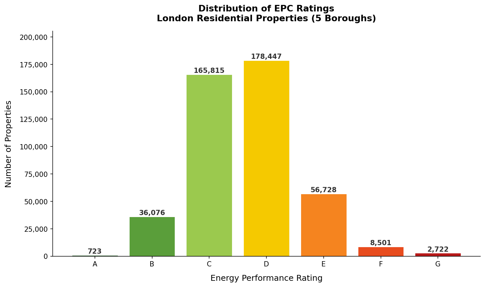
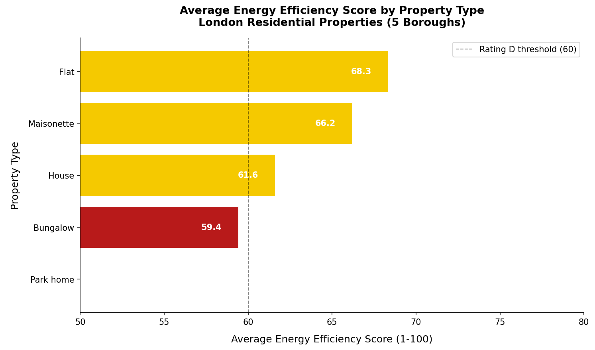
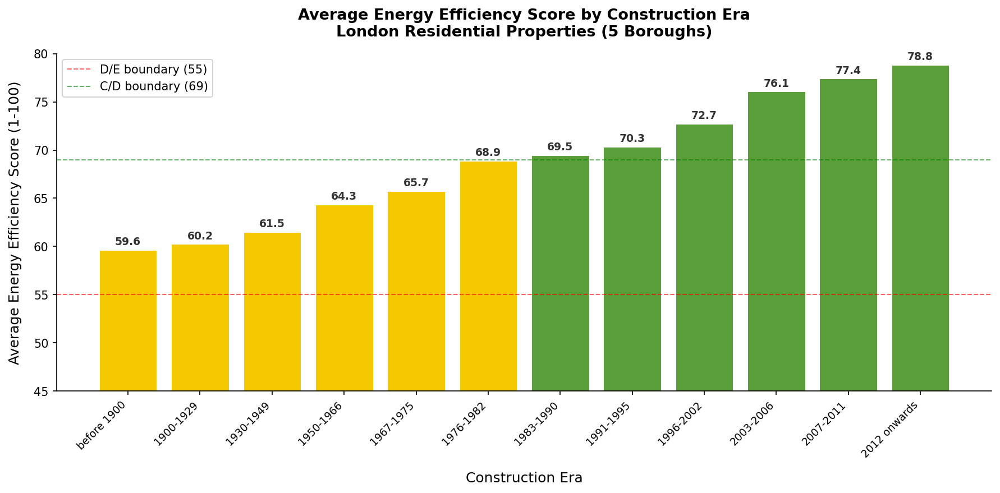
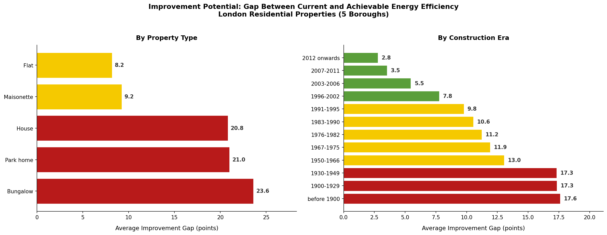

# UK Building Energy Performance Analysis

A Python data analysis of 449,012 residential properties across five London 
boroughs using the UK Government's open Energy Performance Certificate dataset.

## Project Overview

This project analyses real EPC data to answer four questions that local 
authorities and energy consultancies need to understand:

1. How are properties currently distributed across ratings A to G?
2. Which property types perform worst and why?
3. Which construction eras have the worst energy performance?
4. Where is the biggest opportunity for retrofit improvement?

## Key Findings

- **76.6%** of properties are rated C or D, with D being the most common rating
- **Bungalows** are the worst performing property type, averaging 59.4 efficiency score
- Properties built **before 1900** average just 59.6, while post-2012 properties average 78.8
- **Pre-1930 bungalows** have the largest improvement gap at 23.6 points, 
representing the greatest retrofit opportunity

These findings are directly relevant to the UK government's Heat and Buildings 
Strategy target of bringing all homes to EPC band C by 2035.

## Charts

### Chart 1: Distribution of EPC Ratings

### Chart 2: Average Efficiency by Property Type

### Chart 3: Average Efficiency by Construction Era

### Chart 4: Improvement Gap Analysis

## Dataset

Data source: UK Government Energy Performance Certificate Register  
Available at: https://get-energy-performance-data.communities.gov.uk  
Coverage: Lambeth, Southwark, Lewisham, Greenwich, Croydon  
Raw records: 637,773 | Clean records after deduplication: 449,012

## How to Run

1. Download the domestic EPC dataset from the link above
2. Save as `energy_certificates.csv` in the same folder as the notebook
3. Open `epc_analysis.ipynb` in Jupyter Notebook or VS Code
4. Run all cells in order

## Requirements

pandas
matplotlib
seaborn

## Skills Demonstrated

- Python data analysis with pandas
- Data cleaning and deduplication at scale
- Data visualisation with matplotlib and seaborn
- Real government open data
- Building energy performance and UK retrofit policy context

## Author

Fiona Topore  
MEng Architectural Engineering, Cardiff University  
github.com/toporefiona
